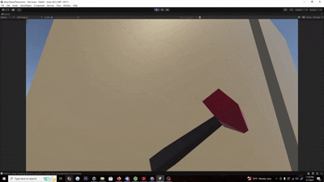
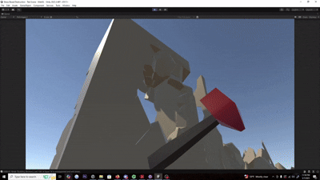

# Stress-Based-Destruction
My attempt to emulate a stress-based destruction system as seen in games such as *Red Faction: Guerrilla*.

## Algorithm:

1. Import a cell-fractured model from Blender, turning each fracture into a node.  
2. Give each node a strength value and link nodes to each other. Each link should also have an associated weight value.  
3. Calculate layers for each node based on the node's Y-value.  
4. Set a flag for all ground nodes.  
5. During the Physics Update, periodically check to see if any stresses are applied to the nodes (such as when hitting with your sledgehammer).  
    a. If so, compare node values to their link weights starting from the top layer.  
    b. If the applied force plus the node strength exceeds the link weight, then have that node break off, and continue propagating stress down the layer.  
    c. Keep going and comparing layer by layer until you reach the ground layer, then stop.  
6. When a node breaks off, turn it into debris, which can then also apply stress forces to unbroken nodes during a collision.

    
    
    
<em>Figure 1: A sledgehammer hit causes stress propagation and debris generation.</em>

  
  
<em>Figure 2: Pre-Baked Node and Link value generation.</em>

